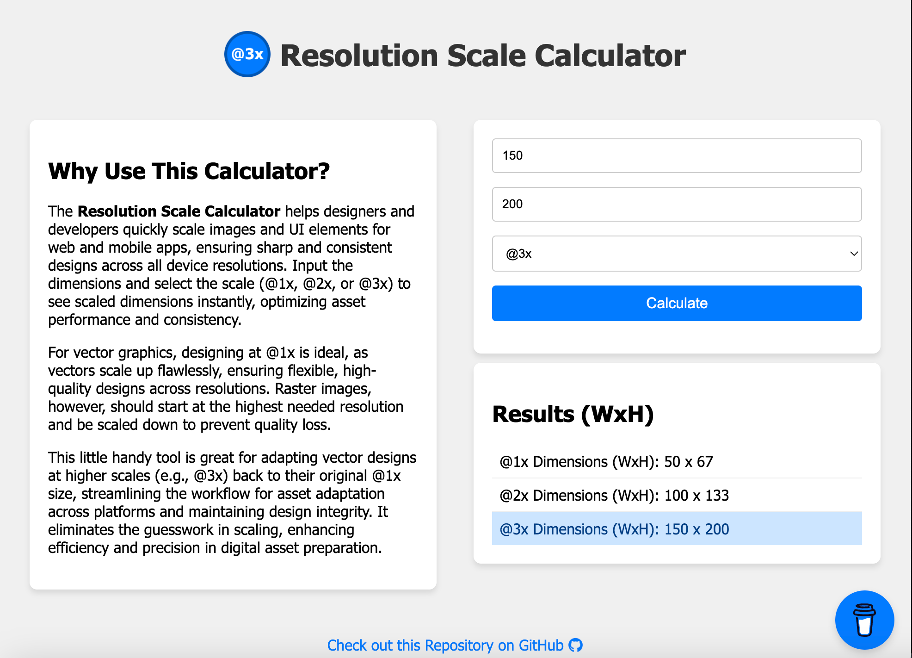

<!-- Begin README -->

    

 

    
    
    
     
    
    
    
     
    
    

---------------

<h1 align="center">Resolution Scale Calculator</h1>

Scale design dimensions (width and height) up or down for @1x, @2, and @3x resolutions.
- Use the application on GitHub Pages **[Here](https://scottgriv.github.io/Resolution-Scale-Calculator/)**.

In the digital design realm, crafting visually compelling and crisp graphics is pivotal. The **Resolution Scale Calculator** emerges as a handly little tool for designers and developers eager to recreate or adapt designs inspired by existing website elements. Here's why incorporating this calculator into your design toolkit is beneficial:

- **Facilitate Design Recreation:** Encounter a design element on a website that resonates with your project's aesthetic? Our tool empowers you to ascertain the dimensions of images or designs, often optimized for high-density displays (@3x), and scale them down accurately to @1x. This foundational step is crucial for vector-based designs, ensuring scalability and adaptability.
- **Vector Design Best Practices:** Vectors are the backbone of versatile design, enabling flawless scaling to accommodate various resolutions. Starting your design process at @1x is a best practice that guarantees ease of scaling up for exports without compromising on quality. The Resolution Scaling Calculator simplifies this process, ensuring that your vectors are primed for perfection from the outset.
- **Optimize Asset Performance:** By accurately scaling down assets for their intended use, you not only enhance the visual fidelity of your project but also optimize performance. Smaller, correctly scaled assets contribute to reduced load times and a smoother user experience across devices.
- **Precision and Efficiency:** Say goodbye to guesswork and tedious manual calculations. Our calculator delivers precise scaling dimensions swiftly, streamlining your design workflow and bolstering productivity.

    
     
    <i>Application Preview</i>

---------------

## Table of Contents

- [Getting Started](#getting-started)
- [Resources](#resources)
- [License](#license)
- [Credits](#credits)

## Getting Started

    
     
     
    

 

Simply input the dimensions (Width x Height) and select the scale (@1x, @2x, or @3x) to see scaled dimensions instantly, optimizing asset performance and consistency.

## Resources

**Design Articles:**
- [Why Designing @1x Is the Best Practice for Scalable Design](https://sympli.io/blog/why-designing-1x-is-the-best-resolution-for-scalable-design)
- [Save your time by designing @1x](https://medium.com/movify/save-your-time-by-designing-1x-2e6e27e36f44)
- [Design at 1x—It’s a Fact](https://medium.com/@kurtvarner/design-at-1x-its-a-fact-249c5b896536)
- [1x, 2x and 3x Image Scaling on iOS Explained](https://www.appypie.com/image-scaling-ios-how-to)
- [What does designing at @1x, @2x, @3x mean? How does it factor into Photoshop and Sketch for example?](https://teamtreehouse.com/community/what-does-designing-at-1x-2x-3x-mean-how-does-it-factor-into-photoshop-and-sketch-for-example)
- [Why do I need @1x, @2x and @3x iOS images?](https://stackoverflow.com/questions/32354453/why-do-i-need-1x-2x-and-3x-ios-images)
- [What should image sizes be at @1x, @2x and @3x in Xcode?](https://stackoverflow.com/questions/30049544/what-should-image-sizes-be-at-1x-2x-and-3x-in-xcode)

**Technologies:**
- [JavaScript](https://www.javascript.com/)
- [HTML](https://www.w3schools.com/html/)
- [CSS](https://www.w3schools.com/css/)
- [PHP](https://www.php.net/)
- [jQuery](https://jquery.com/)
- [XAMPP](https://www.apachefriends.org/index.html)

## License

This project is released under the terms of the **MIT License**, which permits use, modification, and distribution of the code, subject to the conditions outlined in the license.
- The [MIT License](https://choosealicense.com/licenses/mit/) provides certain freedoms while preserving rights of attribution to the original creators.
- For more details, see the [LICENSE](LICENSE) file in this repository. in this repository.

## Credits

**Author:** [Scott Grivner](https://github.com/scottgriv)  
**Email:** [scott.grivner@gmail.com](mailto:scott.grivner@gmail.com)  
**Website:** [scottgrivner.dev](https://www.scottgrivner.dev)  
**Reference:** [Main Branch](https://github.com/scottgriv/Resolution-Scale-Calculator)  

---------------

    

<!-- End README -->
